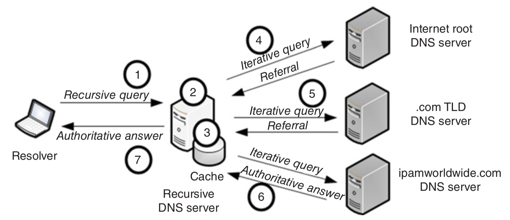

===
DNS
===
* `Troubleshooting DNS with dig <https://youtu.be/cFmy2wNw9RQ>`_
* `DNS Root Servers <https://securitytrails.com/blog/dns-root-servers>`_
* `The Sisyphean Task Of DNS Client Config on Linux <https://tailscale.com/blog/sisyphean-dns-client-linux/>`_

Vocabulary
==========
* Records
    - **A**: Points to IP address
    - **AAAA**: Same as A, but for IPv6
    - **CNAME**: Canonical Name Record. Points to alias (domain/subdomain name)
    - **MX**: Mail eXchange records; tells email delivery agents where to deliver mail
    - **TXT**: flexible Text records, for storing strings for a variety of uses
    - **SOA**: singular Start of Authority record kept at the top level of the domain. Contains specific required information about the domain, for example its primary name server
    - **NS**: The name servers associated with the domain
* ``example.com`` = apex/root/naked domain name

Query
=====
::

    Browser --asks--> ISP DNS
    Browser --asks--> ISP DNS --asks--> root server --returns list of TLD (e.g. .com) servers-->..
                ..--> ISP DNS --asks--> TLD server --returns the authoritative name server-->

Root servers: ``{a..m}.root-servers.net.``

NSSwitch
========

Many programs use libc call `getaddrinfo <http://man7.org/linux/man-pages/man3/getaddrinfo.3.html>`_.

Example: ``ping`` uses nsswitch, while ``host`` doesn't (but both read ``resolv.conf``):

.. code-block:: sh

    strace -f -e trace=open,openat \
        ping -c1 google.com 2>&1 >/dev/null |grep -z -e resolv.conf -e nsswitch

    strace -f -e trace=open,openat \
        host google.com 2>&1 >/dev/null |grep -z -e resolv.conf -e nsswitch

Possible Issues
===============

WWW Problem
-----------
A record::

    A: www.example.com --> 123.123.123.123
    A:     example.com --> 123.123.123.123

CNAME record::

    CNAME: www.example.com --> example.com
    A:         example.com --> 123.123.123.123

Scripting
---------
* use: ``getent hosts example.com`` (is `IPv6-first <https://unix.stackexchange.com/q/50365>`_ though)
* don't: ``host example.com`` (doesn't respect nsswitch; not reliable output format)

.. Root Servers
.. ============

..     dig example.com +trace

