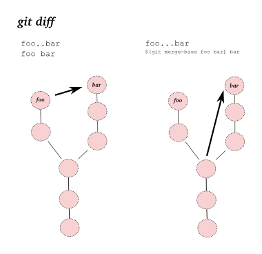

Diff
####
* `When to Use Each of the Git Diff Algorithms <https://luppeng.wordpress.com/2020/10/10/when-to-use-each-of-the-git-diff-algorithms/>`_
* `How different are different diff algorithms in Git? <https://link.springer.com/article/10.1007/s10664-019-09772-z>`_
  - tl;dr: use ``--histogram`` for code changes
* `How to compare files from two different branches <https://stackoverflow.com/questions/4099742/how-to-compare-files-from-two-different-branches>`_

.. image:: imgs/diff.png
  :width: 600
  :target: https://marklodato.github.io/visual-git-guide/index-en.html#diff

.. code-block:: sh

    # Working Directory vs Stage
    git diff
    # Working Directory vs Tree
    git diff ${tree}
    # Stage vs Tree
    git diff --cached ${tree:-HEAD}
    # Tree vs Tree
    git diff ${tree1} ${tree2}

    # ... for a file
    git diff ... -- <path>

    # Compare two current folders
    git diff --no-index dir1 dir2
    # can use non-git diff: diff -r dir1 dir2

    # List files that differ
    git diff --name-only origin/master..origin/mybranch

    # Compare file/folder F1 from branch B1
    # with F2 from branch B2
    git diff origin/B1:path/to/F1 origin/B2:path/to/F2

    # From common ancestor of A and B, to B commit
    git diff A...B
    # same as
    git diff $(git merge-base A B) B

Diff Highlighters
=================
* `delta <https://github.com/dandavison/delta>`_
* `difftastic <https://github.com/Wilfred/difftastic>`_
* `diffr <https://github.com/mookid/diffr>`_
