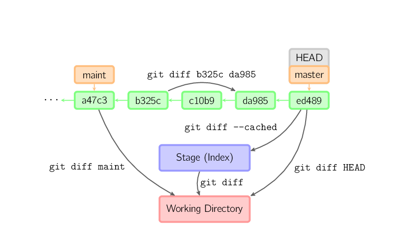

Diff
####
* `When to Use Each of the Git Diff Algorithms <https://luppeng.wordpress.com/2020/10/10/when-to-use-each-of-the-git-diff-algorithms/>`_
* `How different are different diff algorithms in Git? <https://link.springer.com/article/10.1007/s10664-019-09772-z>`_
  - tl;dr: use ``--histogram`` for code changes

.. code-block:: sh

    # Working Directory vs Stage
    git diff
    # Working Directory vs Tree
    git diff ${tree}
    # Stage vs Tree
    git diff --cached ${tree:-HEAD}
    # Tree vs Tree
    git diff ${tree1} ${tree2}

    # ... for a file
    git diff ... -- <path>

    # Compare two current folders
    git diff --no-index dir1 dir2
    # can use non-git diff: diff -r dir1 dir2
