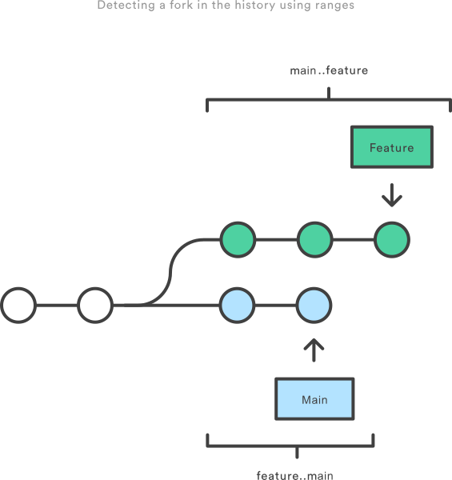

Logs
####
* https://www.atlassian.com/git/tutorials/git-log
* https://stackoverflow.com/questions/51009808/whats-the-difference-between-git-log-and-git-log-decorate
* https://stackoverflow.com/a/7251377
* https://elijahmanor.com/blog/git-log

.. code-block:: sh

    # Print refs: HEAD/branches/tags (defaults to --decorate=short)
    git log --decorate

    # One commit is one line + short hashes
    git log --oneline
    git log --pretty=oneline --abbrev-commit

    # Useful snippet
    git log --graph --oneline --all
    # Third-party alternative
    git-foresta --style=10 --all |less -RSX

    # Local changes, not yet pushed to remote
    git log origin/mybranch..HEAD
    git log @{u}..HEAD

    # Filtering
    # by date
    git log --after=2021-07-01 --before=2021-07-25
    git log --after=2021-07-01 --before=yesterday
    git log --after=2021-07-01 --before=25
    git log --since=2021-07-01 --until=25
    # by author
    git log --author=Lain           # grep-like expression
    git log --author='Lain\|Arisu'
    # by commit message
    git log --grep='bug'
    # by file
    git log -- foo.py bar.py
    # pickaxe: search by added/removed source code
    git log -S"Hello, World!"
    git log -G"bug|fix"
    # by merge (by defaults includes merge commits)
    git log --no-merges  # no merge commits
    git log --merges     # only merge commmits
    # by range
    git log ..
    git log master..feature  # git log <not here>..<here>

    # List files affected by commits
    git whatchanged --since="1 week ago" --oneline

