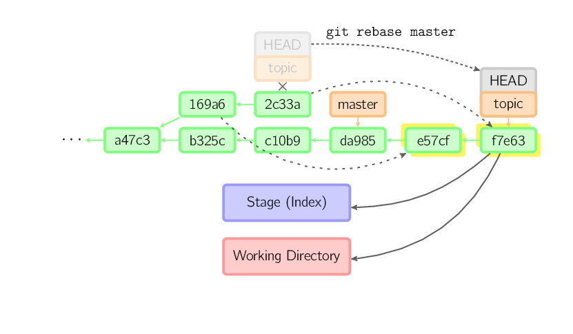

Rebase and Cherry Pick
======================
* https://womanonrails.com/git-rebase-onto

Rebase
------

.. image:: imgs/rebase-onto.png
  :width: 49%
  :target: https://marklodato.github.io/visual-git-guide/index-ru.html#rebase

.. code-block:: sh

    # Rebase featureX on master
    git rebase master featureX == git switch featureX && git rebase master
    git rebase --continue

    git rebase [--onto <newparent>] [<oldparent> [<until>]]

    # Start rebase from (but not including) commit 169a6
    git rebase --onto master 169a6

    git rebase --interactive

::

    git rebase --onto F D
    git rebase --onto F D my-branch

    Before                                    After
    A---B---C---F---G (branch)                A---B---C---F---G (branch)
             \                                             \
              D---E---H---I (HEAD my-branch)                E'---H'---I' (HEAD my-branch)

::

  git rebase --onto F D I
  git rebase --onto F D HEAD

  Before                                    After
  A---B---C---F---G (branch)                A---B---C---F---G (branch)
           \                                        |    \
            D---E---H---I (HEAD my-branch)          |     E'---H'---I' (HEAD)
                                                     \
                                                      D---E---H---I (my-branch)

::

  git rebase --onto F D H
  git rebase --onto F D HEAD^
  git rebase --onto F D HEAD~
  git rebase --onto F D HEAD~1

  Before                                    After
  A---B---C---F---G (branch)                A---B---C---F---G (branch)
           \                                        |    \
            D---E---H---I (HEAD my-branch)          |     E'---H' (HEAD)
                                                     \
                                                      D---E---H---I (my-branch)

Cherry pick
-----------

.. image:: imgs/cherry-pick.png
  :width: 49%
  :target: https://marklodato.github.io/visual-git-guide/index-ru.html#cherry-pick

.. code-block:: sh

    git cherry-pick 2c33a
    git cherry-pick -x 2c33a  # add "(cherry picked from commit ...)" message
