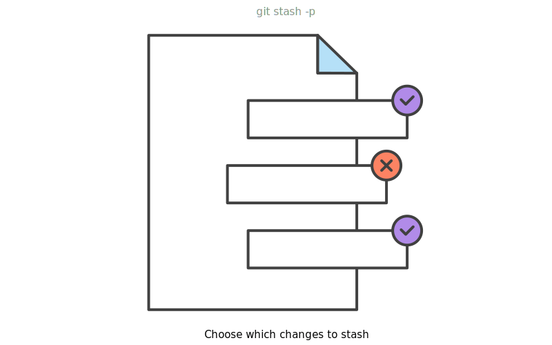
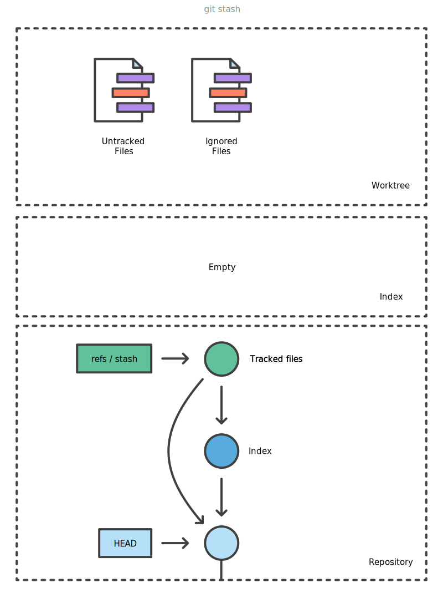

Stash
#####
* https://bluecast.tech/blog/git-stash/
* https://www.atlassian.com/ru/git/tutorials/saving-changes/git-stash

.. image:: imgs/stash-options.svg
  :width: 600
  :target: https://www.atlassian.com/git/tutorials/saving-changes/git-stash#stashing-untracked-or-ignored

.. code-block:: sh

    # Save
    git stash [-u|--include-untracked] [-a|--all]
    git stash push -m "add style to our site" == git stash save "add style to our site"
    # Save specific files
    git stash push -m <message> <path-of-file1> <path-of-file2>
    # Save, including untracked files
    git stash --include-untracked
    # Save, including untracked and ignored
    git stash --all

    # Apply a stash
    git stash apply
    # Same, but throws applied stash away then
    git stash pop
    git stash pop 2 == git stash pop stash@{2}

    # Checkout single file
    git restore -s 'stash@{0}' -SW sqlite-history.zsh
    # Create copy of stashed file under different name
    git show stash@{0}:stashed_file.rb > copy_of_stashed_file.rb

    git stash list
    git stash show [-p|--patch] [<n>]

    git stash drop
    git stash clear
