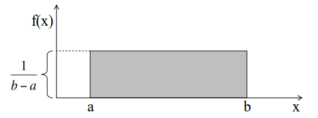

Types of Distributions
######################
* https://medium.com/mytake/understanding-different-types-of-distributions-you-will-encounter-as-a-data-scientist-27ea4c375eec
* https://www.analyticsvidhya.com/blog/2017/09/6-probability-distributions-data-science/

Discrete values
===============

Bernoulli
---------
Two possible outcomes (0 or 1) and a single trial.

.. math::

  P(X = x) = \begin{cases}
  p & \text{if } x = 1 \\
  1 - p & \text{if } x = 0
  \end{cases}
  \qquad \text{where } x \in \{0, 1\}

.. math::

  E(X) = 1*p + 0*(1-p) = p

.. math::

  Variance(X) = E(X^2) – [E(X)]^2 = p – p^2 = p(1-p)

.. image:: imgs/distr_bernoulli.png
  :width: 300
  :target: https://www.analyticsvidhya.com/blog/2017/09/6-probability-distributions-data-science

Uniform
-------

Poisson
-------

Binomial
--------

Exponential
-----------

Continuous values
=================

Normal
------
