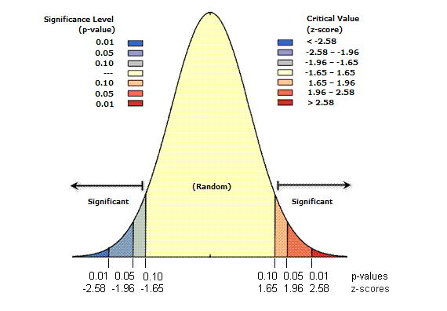

==========
Statistics
==========
.. http://www.pythondoc.com/sphinx/ext/math.html
.. https://chiplicity.readthedocs.io/en/latest/Using_Sphinx/UsingMathEquationsInSphinx.html

.. math::

   (a + b)^2 = a^2 + 2ab + b^2

   (a - b)^2 = a^2 - 2ab + b^2

   \sigma = \sqrt{\frac{\sum_{i=1}^{N}(x_i - \mu)^2}{N}}

If :math:`\sigma_{1}` equals :math:`\sigma_{2}` then etc, etc.

.. Where
.. $\sigma$ is the standard deviation,
.. $x_i$ is each value in the population,
.. $\mu$ is the mean of the population,
.. and $N$ is the number of values in the population.

* **Null hypothesis** (:math:`H_0`) is the claim (conjecture) that no difference or relationship exists between two sets of data or variables being analyzed.
* **Alternative hypothesis** (:math:`H_1` or :math:`H_a`) is what null hypothesis is tested against.
* **Average** (:math:`\mu`)
* **P-value** (significance) is probability that the observed pattern was created by randomness. Under the null hypothesis, the **p-value** is the probability of getting a sample *as or more* extreme than our own.
* **Z-score** is standard deviation.

.. list-table:: Some examples
   :header-rows: 1

   * - z-score (Standard Deviations)
     - p-value (Probability)
     - Confidence level
   * - < -1.65 or > +1.65
     - < 0.10
     - 90%
   * - < -1.96 or > +1.96
     - < 0.05
     - 95%
   * - < -2.58 or > +2.58
     - < 0.01
     - 99%

###############
Kelly Criterion
###############
* https://explore.paulbutler.org/bet/

